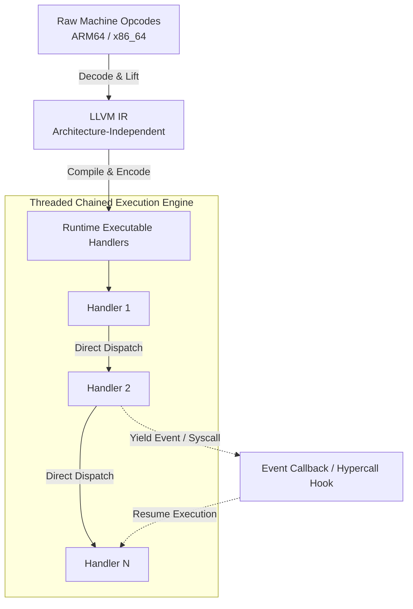

# AetherVM - Lift. Instrument. Emulate. Recover.
**AetherVM** is an LLVM-native binary analysis and emulation platform built around instruction lifting to [LLVM IR](http://llvm.org/docs/LangRef.html). It unifies static, dynamic, and symbolic analysis through a common intermediate representation, enabling advanced instrumentation, runtime recovery, deobfuscation, and program understanding.

AetherVM is motivated by and partially derived from [ICPP](https://github.com/vpand/icpp) and [Remill](https://github.com/lifting-bits/remill).

## Features
- **Dual entry points** — drive the engine from raw architecture state (`Machine`) for shellcode-style analysis, or from a loaded `Binary` for full lifting/instrumentation/analysis workflows.
- **AArch64 & x86_64** — a single unified `Register` enumeration and `RegisterValue`/`RegisterValueSIMD` representation cover both architectures, including flags (`NZCV`/`rflags`), FP/SIMD (`Q0-31`/`XMM0-31`), and legacy x87/MMX state.
- **Rich event/instrumentation hooks** — opt-in, bitfield-configurable events for lifting, memory access, instructions, basic blocks, functions, syscalls, traps, and host bridge calls, delivered through a single `EventCallback`.
- **Direct guest memory access** — map, read, and write guest memory, and translate binary-file addresses to their runtime-mapped equivalents.
- **Host-callable guest code** — turn any guest address into a real, callable host function pointer via `makeExecutable`.
- **Built-in debugger support** — per-VM-thread register access plus an integrated debug port (`EventConfig::debug` / `dbgport`), defaulting to port `60807`.
- **Cross-platform primitives** — a small OS/process abstraction layer (`Platform.h`) for paging, memory access, symbol resolution, and process info on Windows, Linux(Android), and Darwin(macOS, iOS[even un-jailbreak]).

## Public API
Headers are organized under a single `aether` namespace.

| Header | Purpose |
|---|---|
| `AetherVM.h` | The core `BinaryEngine` class — construction, execution, register/memory access, and event registration. |
| `Event.h` | `EventType`, `EventConfig`, `EventResult`, and the `Event`/`EventCallback` types used for instrumentation. |
| `Register.h` | The unified `Register` enum and `RegisterValue`/`RegisterValueSIMD` representations for AArch64 and x86_64. |
| `Platform.h` | OS-level primitives: paging, process memory read/write, dynamic library loading, and process info. |
| `Common.h` | Platform/architecture detection macros and the `AETHER_VMAPI` export/import macro. |
| `Utils.h` | Small header-only utilities: branchless binary search, alignment helpers, and formatted logging. |

### `BinaryEngine`
The central class of AetherVM.

```cpp
// Raw architecture context — shellcode analysis, or driving an existing
// VCPU loop (e.g. ICPP) that already manages its own analysis context.
BinaryEngine(const Machine *mach, EventConfig eventcfg = {});

// Full binary context — lifting, instrumenting, and analyzing everything
// within an attached binary.
BinaryEngine(const Binary *bin, EventConfig eventcfg = {});
```

Key operations:
- `execute(std::span<const uint8_t>)` / `execute(addr_t target)` — run raw opcodes or a static address within the attached binary.
- `runMain()` — run an attached executable's entry point; subclasses implement `recursiveLoad()` to perform relocation binding, segment mapping, and dependent-library loading.
- `makeExecutable(addr_t target)` — obtain a host-callable function pointer for a guest address.
- `getRegister` / `setRegister` — read/write general and SIMD registers, either for the calling thread or for a specific VM thread (`void *cpu`), used internally by the debugger.
- `mapMemory(size_t)`, `readMemory`, `readUInt64`, `writeMemory`, `mappedAddress` — guest memory management and address translation.
- `registerCallback(EventCallback)` — register an instrumentation callback (must be done before executing guest code; not thread-safe).

Subclasses (e.g. Mach-O/ELF/PE engines) override `recursiveLoad()` to implement format-specific loading.

### Events
`EventConfig` is a packed 64-bit bitfield selecting which categories of events fire: `lift`, `memory`, `func`, `block`, `insn`, `syscall`, `trap`, `bridge`, and `debug` (with an associated `dbgport`). Events are delivered as one of `EventRuntime`, `EventLift`, `EventMemory`, or `EventHyperCall` via the `Event` variant, and a callback returns an `EventResult` (`Continue`, `Processed`, or `Terminate`) to control execution.

### Registers
`Register` provides one enum spanning both architectures, with x86_64 names aliased onto the shared general-purpose slots (e.g. `RIP = PC`, `RSP = SP`, `RBP = FP`). `RegisterValue` is a union supporting all integer widths, floats, pointers, and architecture-specific flag layouts (`NZCV` for AArch64, `rflags` for x86_64); `RegisterValueSIMD` covers the 128-bit case.

### Platform layer
`Platform.h` exposes OS primitives used internally by the engine and available for host-side tooling: page allocation/commit/decommit, process memory read/write (optionally targeting another `pid`), dynamic library loading and symbol resolution, and basic process info (`self_path`, `current_pid`, `stack_size`).

## How It Works

AetherVM bridges host execution and guest analysis by lifting native machine code into LLVM IR and dynamic execution handlers:

* **Instruction Lifting:** Raw AArch64 and x86_64 machine opcodes are decoded and lifted into clean, architecture-independent LLVM Intermediate Representation LLVM IR.
* **Handler Encoding:** Each lifted instruction sequence or semantic block is compiled and encoded into an executable target runtime handler function.
* **Threaded Chained Execution:** The dynamic engine executes these handlers sequentially in a threaded chained dispatcher. Instead of relying on full dynamic compilation overhead for every instruction, target execution control flows seamlessly from one prebuilt handler directly to the next, while yielding to event hooks or hypercalls when requested.

### Execution Pipeline Overview



## Build
### Windows prepare
If you're building on Windows, firstly setup the MSVC environment, otherwise skip this:
```sh
# all the following steps must be done in "x64 Native Tools Command Prompt for VS"
# or
# run VS_ROOT/.../VC/Auxiliary/Build/vcvarsall.bat to initialize for 'x64'
# replace it to arm64 if you're on a Windows-ARM64 device.
vcvarsall x64
```

### ICPP Build
To build your own version, you need to have [ICPP](https://github.com/vpand/icpp), **Ninja**, **CMake** available in current terminal session, and pre-build [AetherBinary](https://github.com/AetherVM/AetherBinary). After a recursive clone of this repo to the same directory which contains `AetherBinary`, then build it in one go:
```sh
# build AetherVM
/path/to/icpp build.cc
# build AetherDbg if you'd like
/path/to/icpp lldb/build.cc
```
After aaa... while, the package should be at: build-Release/install.

## Issue
If you encounter any problems when using AetherVM, before opening an issue, please check the [Bug Report](https://github.com/AetherVM/AetherVM/blob/main/.github/ISSUE_TEMPLATE/bug_report.md) template, and provide as many details as you can. Only if we can reproduce the problem, we can then solve it.

## Contact
If you have any questions or thoughts, just feel free to email to me:
```
neoliu2011@gmail.com
```
Any feedback is welcome.
